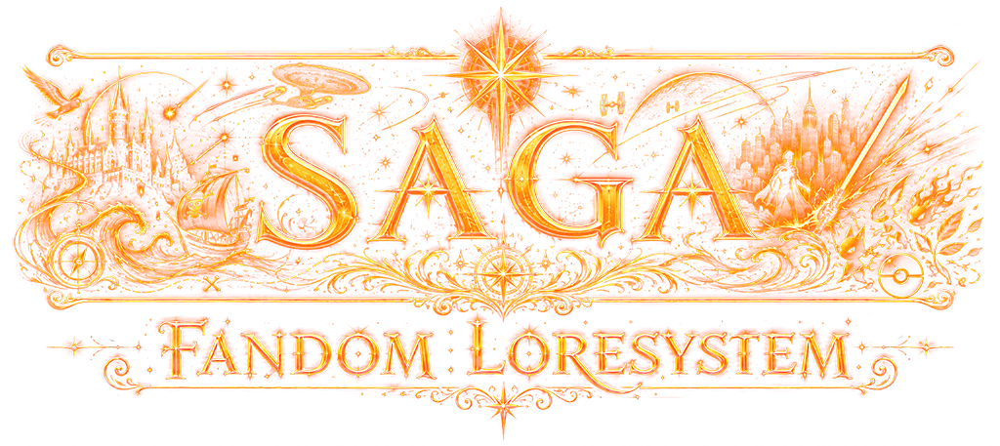

<p align="center">
  
</p>

# SAGA

**SAGA: Fandom Loresystem.**

Saga is a SillyTavern extension for long-form fandom roleplay and fanfiction. It organizes canon, alternate-universe, crossover, and user-created lore into modular **Loredecks** made of reviewable **Lorecards** that can be loaded, stacked, validated, edited, and injected at the right point in a story.

Saga began as Saga, a Harry Potter-focused lore system. Saga proved the core idea: LLMs often know a lot of lore, but they are weak at story position, hidden knowledge, future-canon leakage, and chat-specific continuity. Saga generalizes that idea into a broader, data-driven framework for many fandoms and custom settings.

## Status

Saga is currently in **pre-alpha integration hardening**.

Most foundational systems now exist in some form: the runtime shelf, Loredeck Library, Active Stack, Context browser, Deck Health Center, Loredeck Creator, Pending Review, import/export, theme/icon support, and the split Harry Potter reference Loredeck family. The current focus is proving that those systems work together reliably inside SillyTavern.

Expect active development, incomplete workflows, changing schemas, rough edges, and possible breakage. The repository is not yet a polished public release.

## What Saga Is For

Saga is built for stories where lore has timing, context, and consequences.

It helps answer:

- What lore is true at this point in the story?
- What facts are not known yet?
- What future canon should stay hidden?
- What has this specific chat changed?
- Which loaded fandom decks should influence the next response?
- Which Lorecards are important enough to inject now?
- Which model-generated lore changes need review before they affect play?

Saga is not meant to be a wiki browser. A good Saga Lorecard should change how the model writes a scene: what characters know, hide, want, fear, misunderstand, expect, avoid, reveal, or react to in the current Context.

## Quick Start For Testers

Saga is an extension, not a prompt preset.

1. Install or clone this repository as a SillyTavern third-party extension.

   Typical local development path:

   ```text
   SillyTavern/public/scripts/extensions/third-party/Saga
   ```

2. Restart or reload SillyTavern.

3. Open the Saga shelf from the extension UI.

4. Open **Settings** and configure provider/API settings if you want model-assisted features such as Lore Assistant, Context proposals, or Loredeck Creator.

5. Open **Loredecks** and inspect the bundled reference decks or imported/custom decks.

6. Build an **Active Stack** by loading one or more Loredecks for the current chat.

7. Open **Context** and set where the story currently is inside the loaded deck.

8. Review suggested and accepted **Lorecards** before relying on prompt injection.

9. Use **Deck Health** to validate a deck before sharing it, stacking it, or treating it as a reference model.

For repeatable local UI checks, see [SAGA_VISUAL_SMOKE.md](docs/development/SAGA_VISUAL_SMOKE.md).

## Core Concepts

### Loredeck

A Loredeck is a portable, data-only package of fandom or story-setting knowledge. It can represent canon, AU material, crossover logic, original setting lore, scenario rules, or user-authored additions.

Loredecks are loaded into a chat through the Active Stack. They can be duplicated, customized, imported, exported, validated, and eventually generated through Saga's Creator workflow.

### Lorecard

A Lorecard is one reviewable unit of lore inside a Loredeck. It should be focused enough to retrieve precisely and useful enough to affect the next scene.

Good Lorecards are not broad wiki summaries. They carry specific facts, constraints, reveals, relationships, states, abilities, location conditions, knowledge boundaries, or timeline events.

### Context

Context is Saga's story-position system. It tells Saga where the current chat is inside a deck's source range.

Context can be based on dates, school years, books, arcs, chapters, seasons, episodes, quests, routes, phases, stardates, or any other coordinate system that fits the fandom. The point is not exact dates everywhere. The point is making lore eligible only when it belongs.

### Active Stack

The Active Stack is the ordered set of loaded Loredecks for the current chat. Stack priority helps decide which deck wins when multiple decks could contribute lore.

This is what allows Saga to support custom overlays, crossovers, AU decks, and user-edited variants without flattening everything into one lorebook.

### Pending Review

Pending Review is the safety layer for proposed changes. Model-generated lore, timeline edits, tag changes, and repair suggestions should be reviewed before they become accepted deck content.

Saga is designed around review-first workflows rather than silent model mutation.

### Deck Health

Deck Health validates whether a Loredeck is technically reliable. It checks loading, manifests, entry files, schema expectations, Context/timeline references, tag registries, stats, and other structural issues.

Clean Deck Health does not prove every lore fact is canonically perfect, but it does mean Saga can load and reason over the deck without known structural problems.

## Feature Overview

### Loredeck Library

Browse and manage bundled, generated, imported, duplicated, and custom Loredecks. The Library is the long-term home for deck organization, deck covers, metadata, folders, import/export, updates, details, and health actions.

### Active Stack Manager

Load multiple Loredecks into a session, reorder them, enable or disable them, and control which decks participate in Context, retrieval, and injection.

### Context Browser

Search or select story waypoints from loaded Loredecks. Saga can work with timelines, windows, anchors, before/after boundaries, and Lorecard-derived event candidates when useful.

### Lorecards

Inspect accepted and pending Lorecards, edit metadata, review generated proposals, adjust relevance, and keep chat-specific accepted lore separate from source deck data.

### Injection Preview

Saga's injection layer decides which Lorecards actually reach the model prompt. It accounts for Context gates, accepted lore, relevance, pin/mute state, stack priority, compression, and prompt placement.

### Deck Health Center

Validate decks before relying on them. Deck Health groups errors, warnings, and suggestions so deck authors can repair issues systematically instead of guessing why a deck behaves strangely.

### Loredeck Creator

Saga's Creator is a staged workflow for generating Loredecks without asking a model to produce an entire deck in one giant response.

The intended flow is:

1. Scope Brief
2. Story Outline and Context Plan
3. Lorecard Title Pass
4. Timeline and Tag Planning
5. Lorecard Drafting
6. Review and Pending Review
7. Deck Health and finalization

Generated content is draft material until it survives review.

### Lore Assistant

The Lore Assistant is a model-assisted helper for revising entries, tags, timelines, Deck Health issues, and natural-language bulk edits. It should produce reviewable proposals, not silent changes.

### Continuity Tools

Saga preserves Saga's continuity-tracking direction: durable story lore, lightweight continuity state, reviewable scans, and responsive status feedback. The goal is to remember what this chat changed without mixing that state into static canon decks.

### Import, Export, And Updates

Saga supports local Loredeck import/export and is building toward safer update previews, canonical content hashes, collision handling, local modification warnings, and generated-to-custom installation flows.

### Provider Flexibility

Saga is model/provider agnostic. Stronger reasoning models are useful for Context proposals, Loredeck Creator planning, and more complex lore repairs. Faster utility models can be useful for small revisions or lower-stakes suggestions.

Provider behavior varies. Treat model output as draft material until reviewed.

### Themes And Icon Sets

Saga includes theme and icon set support so the runtime shelf can evolve visually without mixing executable code into visual assets. Like Loredecks, theme and icon assets should remain passive data.

## Bundled Reference Decks

The current reference data is the split Harry Potter Golden Trio Loredeck family:

- `hp-core`
- `hp-year-1-philosophers-stone`
- `hp-year-2-chamber-of-secrets`
- `hp-year-3-prisoner-of-azkaban`
- `hp-year-4-goblet-of-fire`
- `hp-year-5-order-of-the-phoenix`
- `hp-year-6-half-blood-prince`
- `hp-year-7-deathly-hallows`
- `hp-epilogue-post-war`

This family is the model for how a large fandom can be split into reusable core lore plus narrower era, year, arc, or post-canon decks. Future bundled decks should meet the same bar: clean Deck Health, clear Context boundaries, consistent manifests, useful tags, and no unreviewed generated material treated as canon.

## Documentation

Release-facing documentation is being organized under [docs](docs/DOCUMENTATION_INDEX.md).

Key docs:

- [Documentation Index](docs/DOCUMENTATION_INDEX.md)
- [Loredeck And Lorecard Creation](docs/loredecks/LOREDECK_AND_LORECARD_CREATION_GUIDE.md)
- [LLM Loredeck Generation Guide](docs/loredecks/LLM_LOREDECK_GENERATION_GUIDE.md)
- [Loredeck Schema Reference](docs/loredecks/SAGA_LOREDECK_SCHEMA.md)
- [Saga Terminology](docs/development/SAGA_TERMINOLOGY.md)
- [Alpha Release Systems](docs/development/SAGA_ALPHA_RELEASE_SYSTEMS.md)
- [Visual Smoke Runbook](docs/development/SAGA_VISUAL_SMOKE.md)

Development notes still live in [docs/development](docs/development/) until they are promoted, rewritten, or archived as release-facing docs.

## Development Checks

HP reference deck health and conformance:

```powershell
node scripts\test-hp-loredeck-health.mjs
node scripts\test-hp-loredeck-v3-conformance.mjs
node scripts\test-hp-reference-deck-conformance.mjs
```

Context-sensitive checks:

```powershell
node scripts\test-context-hp-phrase-fixtures.mjs
node scripts\test-context-current-contract.mjs
```

Visual smoke harness checks:

```powershell
node scripts\test-visual-smoke-harness.mjs
node scripts\serve-visual-smoke.mjs --check --port 0
```

Local visual smoke server:

```powershell
node scripts\serve-visual-smoke.mjs
```

Then open:

```text
http://127.0.0.1:8765/tests/visual-smoke.html
```

## Project Layout

```text
Loredecks/              Bundled Loredeck data and index.
Images/                 Branding, icons, screenshots, and passive assets.
Presets/                Optional provider/preset data.
docs/loredecks/         Release-facing Loredeck authoring docs.
docs/development/       Planning, audits, runbooks, and implementation notes.
scripts/                Local tests, smoke helpers, and deck maintenance scripts.
tests/                  Visual smoke harness fixtures.
```

Important runtime modules:

- `index.js`: extension entrypoint and SillyTavern integration.
- `lore-panel.js`: current runtime shell/controller while decomposition continues.
- `loredeck-loader.js`: Loredeck loading, validation, Context, tags, and Deck Health behavior.
- `loredeck-library-panel.js`: Library UI.
- `loredeck-health-panel.js`: Deck Health UI.
- `loredeck-assistant.js`: model-assisted Creator and Lore Assistant prompt builders.
- `loredeck-creator-projects.js`: Creator project state and review-stage helpers.
- `context-resolver.js`: Context resolution logic.
- `context-index.js`: searchable Context index over loaded decks.
- `prompt-injector.js`: prompt injection bridge.
- `state-manager.js`: persisted Saga state.

## Relationship To Saga

Saga started as a lightweight Harry Potter preset and lore workflow for SillyTavern. It emphasized date-aware canon anchoring, roleplay prose controls, anti-slop prompting, character set toggles, dynamic canon guidance, and manual lorebook support.

Saga keeps the strongest product lessons and moves them into a general extension architecture:

- Manual canon anchoring becomes Context.
- Lorebook-style facts become Lorecards.
- Static HP-specific lore becomes portable Loredecks.
- Dynamic canon becomes Context-gated retrieval and spoiler control.
- Reviewable lore suggestions become Pending Review.
- Prompt placement and relevance controls become the Injection system.
- HP-only assumptions become fandom-agnostic schema, tags, timelines, and deck stacks.

Saga is not just Saga with more fandoms. It is the broader framework that Saga was pointing toward.

## Authoring Loredecks

Start with:

- [Loredeck And Lorecard Creation](docs/loredecks/LOREDECK_AND_LORECARD_CREATION_GUIDE.md)
- [LLM Loredeck Generation Guide](docs/loredecks/LLM_LOREDECK_GENERATION_GUIDE.md)
- [Loredeck Schema Reference](docs/loredecks/SAGA_LOREDECK_SCHEMA.md)

Reference-quality decks should be data-only, Context-aware, reviewable, and clean under Deck Health. Do not treat parsed JSON as finished content. A deck is ready to model future work only when it loads cleanly, retrieves at the right Context, keeps future lore gated, and has no outstanding health issues.

## License

See [LICENSE](LICENSE).
