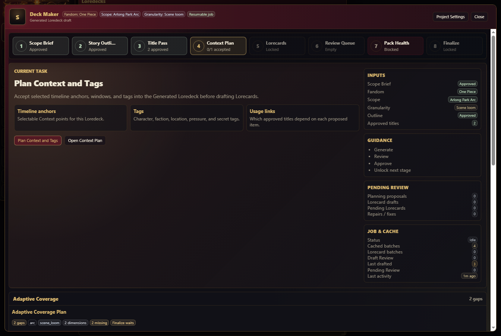
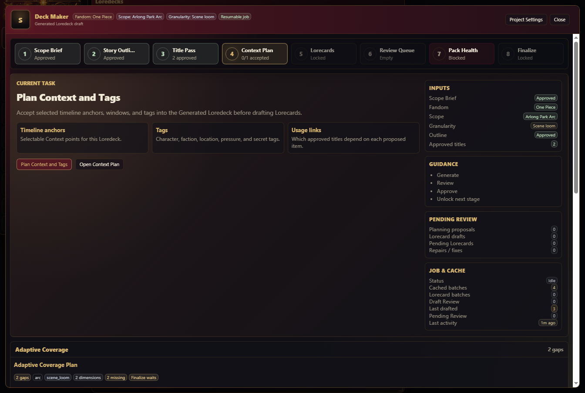
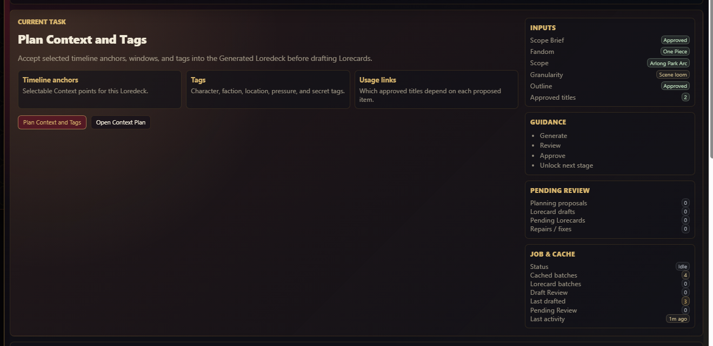
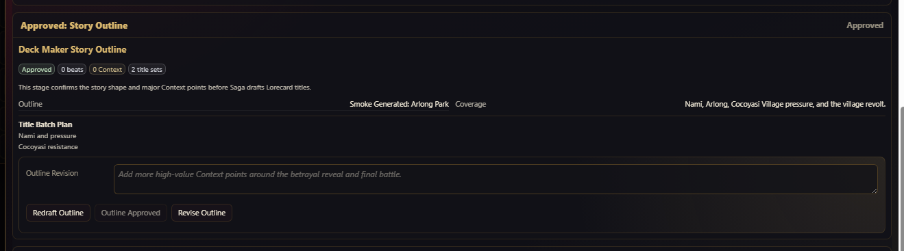
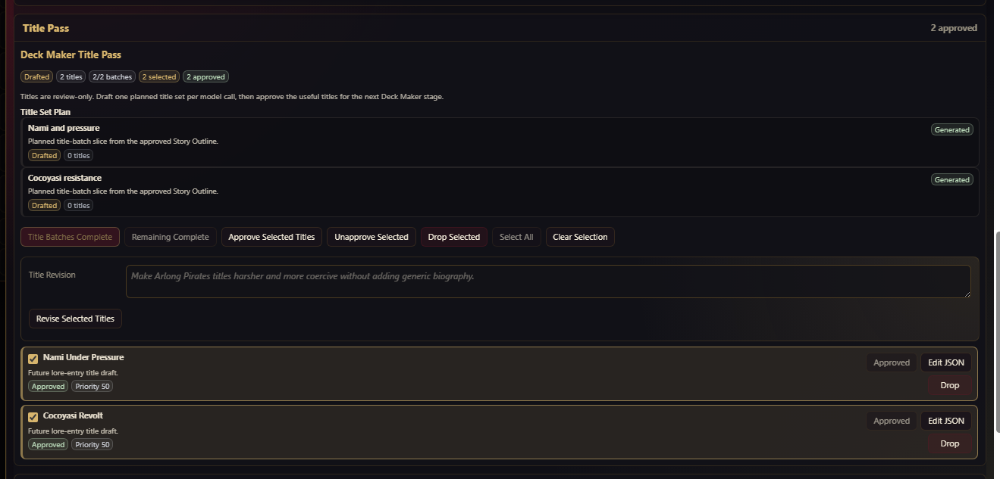
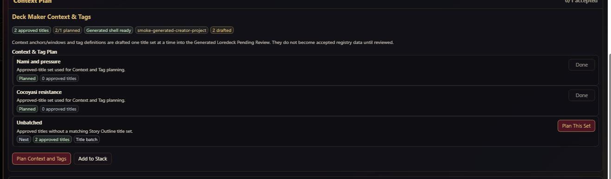
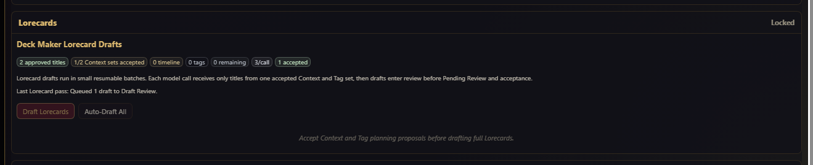
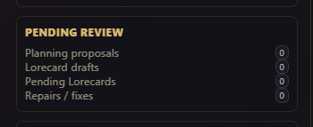

# Deck Maker Guide for Desktop

This guide covers the desktop and tablet-width **Deck Maker** UI. It assumes you are using the desktop rail, Loredecks tab, and fullscreen Deck Maker workbench.

Deck Maker creates **Generated Loredecks** through staged, review-first authoring. It is not a one-shot "generate a whole deck" button. Every model-backed stage creates reviewable structure or draft material before it becomes durable Loredeck data.

## Requirements

Deck Maker is an Advanced workflow.

Before using it:

- switch Saga to **Advanced**
- configure a **Reasoning Provider**
- decide the fandom, scope, and story granularity
- expect to review generated output
- run Pack Health before trusting or finalizing the result

## Opening Deck Maker

Open **Loredecks** and use **Create Deck**.

  

The Loredecks tab also contains **In Progress** Deck Maker projects. Use the project shelf to resume unfinished projects, search/filter them, select visible projects, move linked Generated Loredecks to folders, rename projects, or delete stale drafts.

## Workbench Layout

  

The desktop workbench has:

- a top header with project identity and **Project Settings**
- **Close**
- a horizontal stage roadmap
- the **Current Task** card
- the active stage body
- side panels for inputs, guidance, pending review, and job/cache state
- adaptive coverage and readiness sections when available

The roadmap stages are:

1. **Scope Brief**
2. **Story Outline**
3. **Title Pass**
4. **Context Plan**
5. **Lorecards**
6. **Review Queue**
7. **Pack Health**
8. **Finalize**

Roadmap stage cards show status and can include reset controls. **Reset to this step** deletes downstream Deck Maker progress after the selected step. Do not reset casually; it is for correcting a bad stage before continuing.

## Current Task

  

The **Current Task** card tells you what to do next. It usually includes the next generation or review action, a short explanation, and the inputs required to unlock the next stage.

When a provider run is active, the current task can show running status and cancellation controls. Cancelled or late provider responses are ignored.

## Project Settings

Use **Project Settings** to return to editable project inputs or approved scope information.

Project inputs include:

- fandom
- scope
- granularity
- notes or coverage instructions
- generated deck identity
- provider/generation settings when exposed for the project

Change project settings before generating downstream stages. If you change the scope after approving later stages, reset to the correct stage so old downstream data does not survive under a new premise.

## Scope Brief

The **Scope Brief** establishes the deck identity and authoring target.

It can show:

- title
- deck ID
- fandom
- scope
- coverage summary
- granularity
- approval state

Approve the Scope Brief only when the deck should be built from that premise. If the brief asks for the wrong story range or too broad a scope, revise before approving.

## Story Outline

  

The **Story Outline** defines the story shape before title generation.

It can include:

- story beats
- Context milestones
- title-batch slices
- assumptions or clarification questions

Approve the outline before moving into Title Pass. A weak outline creates weak title batches and usually causes later Context or Lorecard gaps.

## Title Pass

  

The **Title Pass** drafts candidate Lorecard titles in planned batches.

Controls and states can include:

- generated title sets
- drafted/completed title-batch chips
- selected title rows
- approved title chips
- **Generate Next Title Batch**
- **Generate Remaining**
- **Approve Selected Titles**
- **Unapprove Selected**
- **Drop Selected**
- **Select All**
- **Clear Selection**
- **Revise Selected Titles**
- per-title **Edit JSON**
- per-title **Drop**

Titles are not Lorecards yet. They are a plan for what Lorecards should be drafted later. Approve only titles that should become actual generated entries.

## Context & Tags

  

The **Context & Tags** stage builds registry structure for the Generated Loredeck.

It drafts:

- timeline anchors
- timeline windows
- tag definitions
- usage links between approved titles and proposed Context/tag records

Controls can include:

- **Plan Context and Tags**
- **Plan This Set**
- **Open Context Plan**
- **Add to Stack**

Generated Context and tag proposals are reviewable. They do not become accepted registry data until you review and accept them.

## Lorecard Drafts

  

The **Lorecards** stage drafts schema v3 entries from approved titles and accepted Context/tag planning.

Controls can include:

- **Draft Lorecards**
- **Auto-Draft All**

Deck Maker drafts in small resumable batches. Auto-Draft All confirms the remaining Lorecard count and model-call count before running multiple calls.

Deck Maker separates provider failures from Saga-side validation rejections. When a model returns parseable JSON with invalid title targets, unknown tags, unknown anchors, unknown windows, or wrong batch references, Saga keeps valid drafts, records compact rejection details, and can retry affected titles in smaller batches.

Useful diagnostics:

- **Last Lorecard preflight gaps**
- **Last Lorecard rejection details**
- **Deck Maker preflight note**
- **Deck Maker repair note**

## Review Queue And Draft Review

  

The workbench tracks review queues for:

- planning proposals
- Lorecard drafts
- Pending Lorecards
- repairs or fixes

Deck Maker Lorecard drafts go through **Draft Review** before normal Pending Review. Draft Review can include:

- **Send Selected to Review**
- **Send All to Review**
- **Drop Selected**
- **Select All**
- **Clear Selection**
- **Revise Selected**
- per-draft **Send to Review**
- per-draft **Edit JSON**
- per-draft **Drop**

Sending a draft to review does not automatically accept it as durable lore. It moves it into the normal Pending Review flow.

## Pack Health

Use **Pack Health** before trusting a Generated Loredeck.

Deck Maker readiness actions can include:

- **Run Pack Health**
- **Open Pack Health Center**
- **Attempt Fixing**

Pack Health checks structural usability: schema, manifest, tags, timeline references, Context gates, stats, and related package expectations. It is not a canon-truth oracle.

## Readiness Gate And Finalize

  

The **Deck Maker Readiness Gate** summarizes whether the Generated Loredeck is ready to become a normal Custom Loredeck.

It can show:

- pipeline completeness
- title-set progress
- accepted Context set progress
- accepted title coverage
- Pack Health status
- adaptive coverage status
- blockers
- warnings
- remaining entry count

Readiness actions can include:

- **Open Coverage Plan**
- **Finalize Anyway**
- finalization actions when blockers are resolved

**Finalize Anyway** records that the current light or missing coverage was deliberate. Use it only when the generated deck is intentionally partial.

## In-Progress Project Shelf

The Loredecks tab shows unfinished Deck Maker projects in **In Progress**.

Use the shelf to:

- resume a project
- rename a project
- filter by status
- search by title, fandom, scope, stage, or linked Generated Loredeck
- select visible projects
- move selected projects and linked Generated Loredecks to a folder
- delete stale projects

Deleting a Deck Maker project removes the saved generation workflow and linked generated working pack when applicable. Cancel active generation before deleting a running project.

## Desktop Workflow

1. Open **Loredecks**.
2. Click **Create Deck**.
3. Fill project inputs.
4. Draft and approve the **Scope Brief**.
5. Draft and approve the **Story Outline**.
6. Generate title batches in **Title Pass**.
7. Approve only useful titles.
8. Plan and review **Context & Tags**.
9. Draft Lorecards in small batches.
10. Review drafts before sending them to Pending Review.
11. Accept or reject Pending Review entries.
12. Run **Pack Health**.
13. Resolve blockers or intentionally acknowledge light coverage.
14. Finalize as a Custom Loredeck only when the generated pack is ready.

## Desktop Troubleshooting

| Problem | First check |
| --- | --- |
| Create Deck is missing | Switch to Advanced. |
| Generation fails | Test the Reasoning Provider in Settings. |
| Later stages are locked | Complete and approve the earlier stage shown in the roadmap. |
| Titles are poor | Revise or drop title drafts before Context planning. |
| Lorecard drafting is blocked | Accept Context and Tag planning proposals first. |
| Drafts are rejected | Read preflight gaps and rejection details, then retry smaller or repair references. |
| Finalize is blocked | Run Pack Health and resolve readiness blockers. |
