# Saga for Mobile Operator's Manual

This manual covers Saga's phone layout. It is for operators using the fixed bottom navigation, touch-sized controls, mobile subviews, and long-press detail sheets.

For desktop and tablet-width operation, see [Saga for Desktop Operator's Manual](DESKTOP_OPERATOR_MANUAL.md). For short workflow guides, see [Basic Workflow](BASIC_WORKFLOW.md) and [Advanced Workflow](ADVANCED_WORKFLOW.md). For complete authoring guides, see [Story Maker Guide for Mobile](STORY_MAKER_MOBILE_GUIDE.md) and [Deck Maker Guide for Mobile](DECK_MAKER_MOBILE_GUIDE.md).

## Mobile Shell Basics

Saga for Mobile replaces the floating desktop rail and drawer with a full-height mobile window and a fixed bottom bar. The active bottom tab becomes **Exit**. Tap another route to switch surfaces; tap **Exit** to close Saga.

Basic mobile routes are **Loredecks**, **Session**, **Context**, **Lorecards**, and **Settings**. Advanced adds **Continuity** and **Injection**, and exposes Deck Maker, Pack Health Center repair, Lore Automation, and deeper settings.

  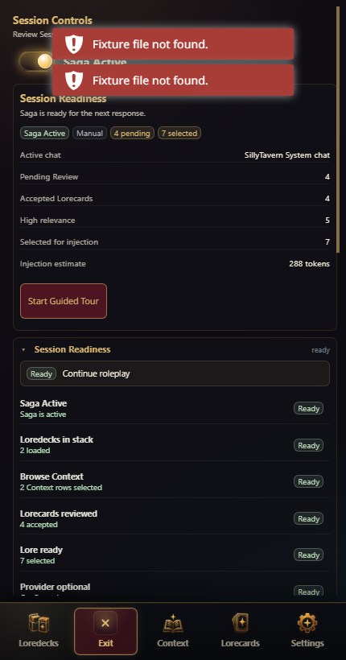

Start in **Session**. It shows whether Saga is active, how many Lorecards are pending, how many are selected for injection, and whether the current chat has useful lore ready. Tap the Session summary to open Session Details when you need the guided checklist, walkthrough notes, toggles, and metrics.

## Story Maker

  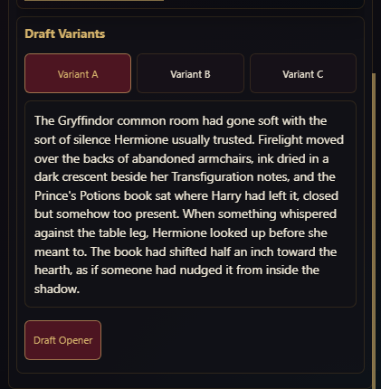

**Story Maker** lives in the mobile **Session** route. Use it after Loredecks, Context, and useful Lorecards are ready, when you want Saga to create a lore-aware opening post for the current scene.

The mobile Story Maker workflow is:

1. Tap **Session**.
2. Open **Story Maker**.
3. Create or select a saved opener.
4. Fill **Inputs**.
5. Build the Context Packet and Opener Brief.
6. Draft variants.
7. Revise or copy the selected opener.

For every mobile field, stage, source action, variant action, revision path, and failure state, use [Story Maker Guide for Mobile](STORY_MAKER_MOBILE_GUIDE.md).

## Basic Mobile Loop

Use Basic mobile as a five-step loop:

1. Open **Loredecks** and confirm at least one deck is active.
2. Open **Context** and set or review the current story position.
3. Open **Lorecards** and review generated or suggested cards.
4. Return to the chat and continue roleplay.
5. Use **Settings** only when providers, experience mode, theme, or storage safety need attention.

The mobile shell is optimized for checking readiness and moving quickly between these surfaces. It intentionally avoids the dense desktop control room unless you switch to Advanced.

## Loredecks

  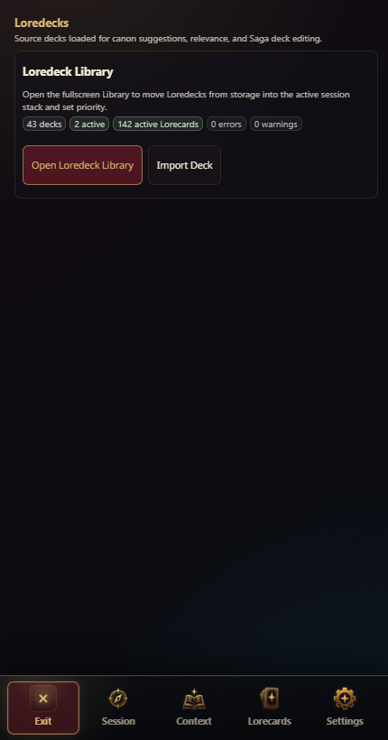

The **Loredecks** route shows the active stack summary and the main Library action. Open the **Loredeck Library** to browse decks, add or remove active decks, reorder the stack, inspect details, import packages, or run Pack Health checks.

  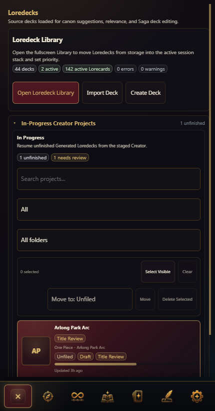

Advanced mobile adds **Create Deck** alongside Library and import actions. Use Deck Maker only when you are ready for staged Loredeck authoring and review.

  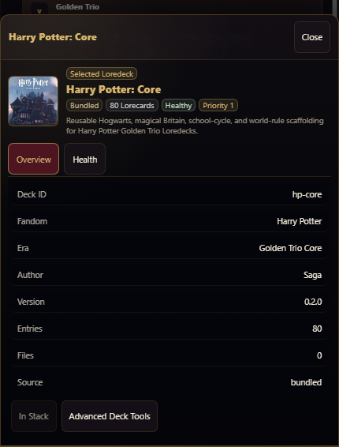

In the mobile Library:

- Tap a deck card to add or remove it from the active order.
- Long-press a deck card to open its detail sheet.
- Use **Reorder** in the selected strip to adjust active deck order.
- Use **Clear** only when you want to remove the selected active deck set.
- Open a detail sheet before trusting a deck in a long-running story.

## Pack Health

  

Pack Health status and **Run Pack Health** checks are available from Loredeck detail sheets. Basic shows the summary and scan action; Advanced opens the **Pack Health Center** for grouped issues, repair sessions, package diagnostics, and exportable reports. Use it after importing, generating, duplicating, or heavily editing a deck. A clean health report means the deck is structurally usable; it does not prove every lore claim is canon-perfect.

On mobile Advanced, Pack Health Center keeps primary actions at the bottom. Use **Refresh Scan** after changes, **Export Report** when collecting evidence, and **Close** to return to the Library.

## Context

  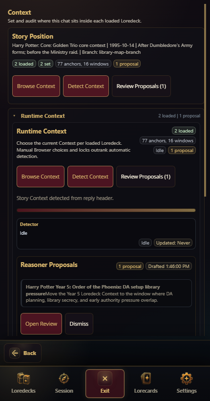

**Context** tells Saga where the chat is inside each loaded Loredeck. On mobile, the root Context route summarizes loaded decks, selected story positions, and pending proposals. Tap the Story Position summary to open Context Details.

Use **Browse Context** when you need to choose exact anchors, windows, dates, arcs, or phases.

  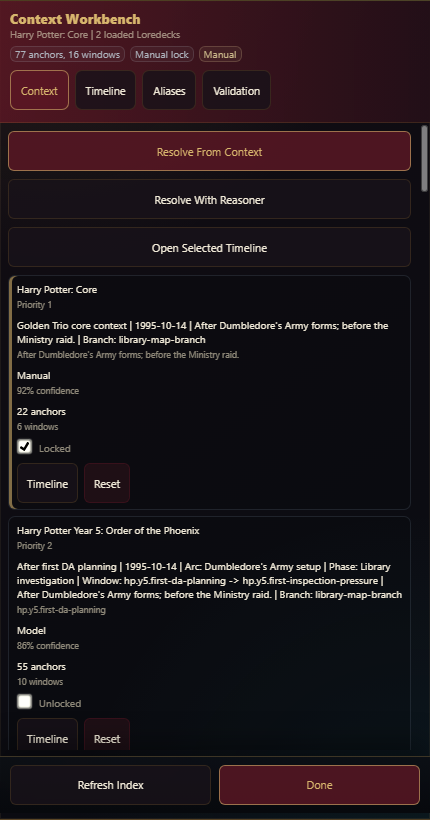

Use **Review Proposals** when Saga has Reasoner-backed Context changes waiting for review. Apply only proposals that match the current story branch.

  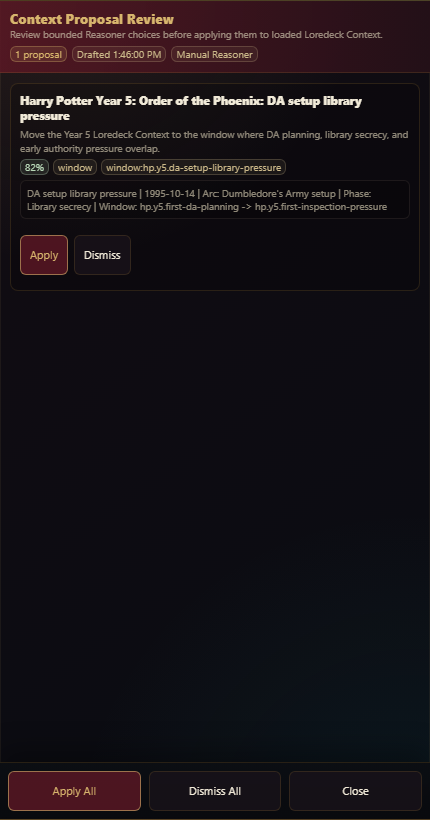

## Lorecards

  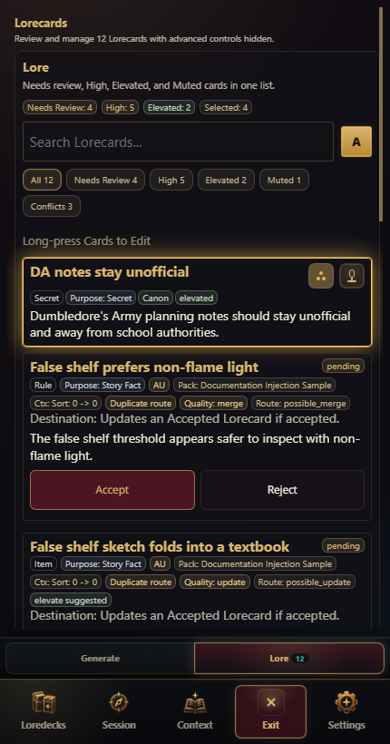

Mobile Lorecards use sub-tabs above the bottom bar:

- **Lore**: one object list for Pending Review, Accepted, High relevance, Elevated, and Muted Lorecards.
- **Generate**: canon preview, story scan, and Manual Lore Note drafting.
- **Automation**: Advanced-only Lore Automation status and controls.

In **Lore**, Pending Review and Accepted cards are object rows. Review Pending entries before they become durable lore. Accepted entries can be High relevance, Muted, Elevated, or protected by Lore Automation state. Tap the relevance dots to cycle tier, use the mic control to Mute, double-tap an Accepted card to toggle Elevation, and long-press to edit.

  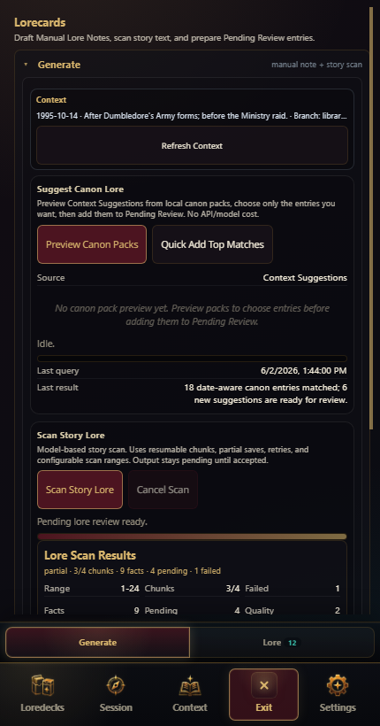

Use **Generate** for **Preview Canon Packs**, **Quick Add Top Matches**, **Scan Story Lore**, and **Draft Manual Note**. Generated or manually drafted lore still goes through Pending Review.

  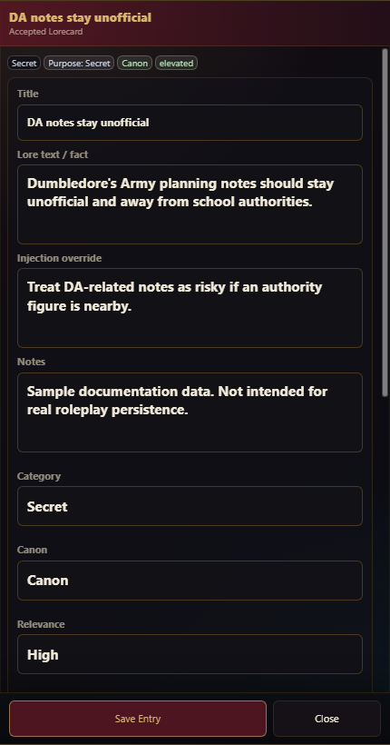

Long-press an Accepted Lorecard to edit it. The mobile editor keeps fields full-width and uses chip-style tag editing instead of dense desktop row controls.

  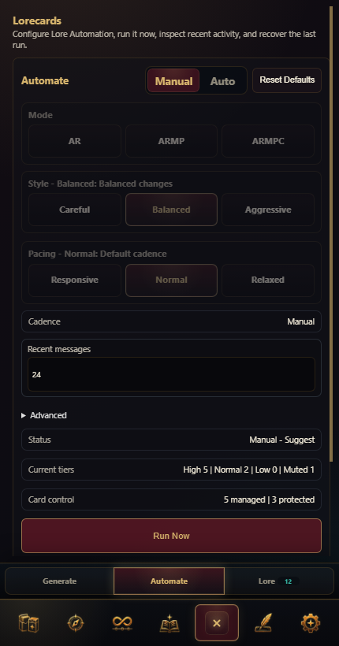

In Advanced, use **Automation** to inspect Lore Automation mode, cadence, recent activity, and per-card management. Automatic changes should remain inspectable and reviewable.

## Continuity

  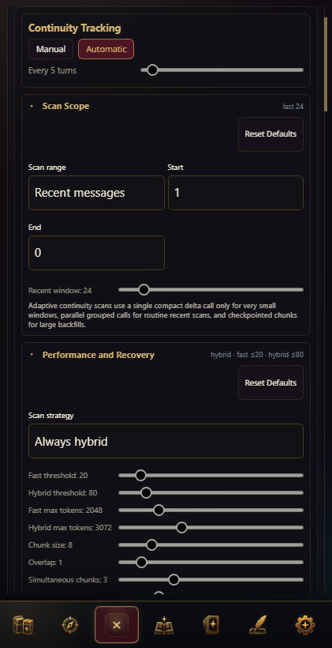

Continuity is Advanced-only on mobile. Use it for live state: scene, active characters, carried items, goals, and open threads. Continuity Scan helps update current state from recent chat; it should not become a second static lore database.

## Injection

  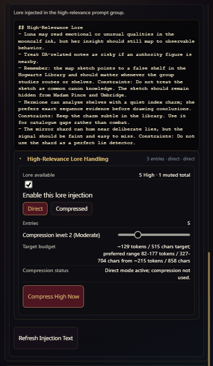

Injection is Advanced-only on mobile. Use it when debugging what Saga will send to the model. A Lorecard can exist and be accepted without injecting if it is muted, out of Context, disabled, lower priority, or outside the configured prompt budget.

The preview is the operator truth source for "why did the model know this?" and "why did the model forget this?"

## Deck Maker

  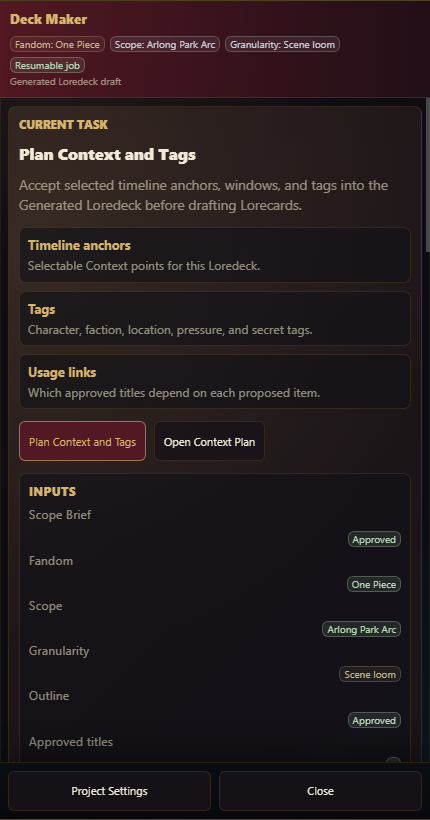

The mobile Deck Maker keeps the current task and review queue near the top. Use it for staged Loredeck authoring, not one-shot generation. Generated material remains draft material until reviewed, moved to Pending Review, accepted, and checked in Pack Health.

For every mobile stage, current-task action, project input, draft-review path, Pack Health action, and finalization gate, use [Deck Maker Guide for Mobile](DECK_MAKER_MOBILE_GUIDE.md).

## Settings

  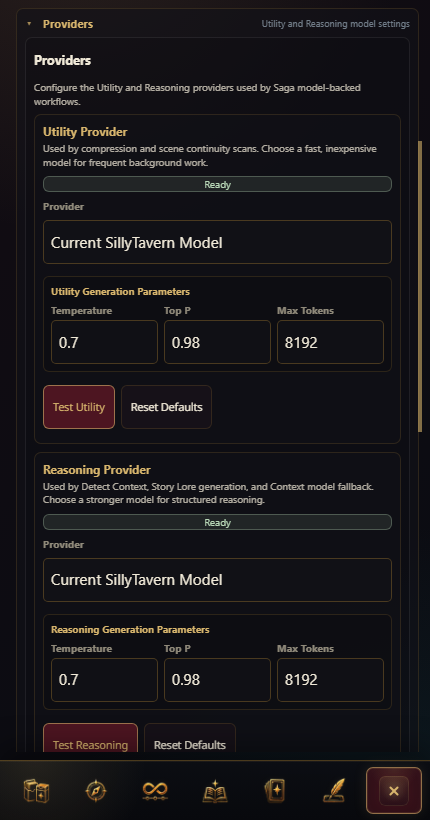

Use mobile Settings for experience mode, providers, theme, State Safety, and cleanup. Advanced Settings expose provider routing and storage maintenance. Prefer SillyTavern Connection Profiles for provider isolation when available.

## Mobile Troubleshooting

| Problem | First check |
| --- | --- |
| Bottom bar is missing | Confirm the viewport is phone-width and Saga is open. Wider tablet/desktop viewports use the desktop shell. |
| Active tab says Exit | That is expected. Tap **Exit** to close Saga or another route to switch surfaces. |
| A Loredeck detail sheet will not open | Long-press the deck card instead of tapping it. Tapping toggles active order. |
| Lorecard edit controls are not visible | Long-press an Accepted Lorecard row. Mobile hides permanent row-action button stacks. |
| Injection or Continuity is missing | Switch to Advanced. Basic mobile keeps those routes hidden. |
| Context feels wrong | Open Context, review the Story Position summary, then use Browse Context or Review Proposals. |
| A generated deck behaves strangely | Open its detail sheet, then run Pack Health. |
