# Saga for Mobile Operator's Manual

This manual covers Saga's phone layout. It is for operators using the fixed bottom navigation, touch-sized controls, mobile subviews, and long-press detail sheets.

For desktop and tablet-width operation, see [Saga for Desktop Operator's Manual](DESKTOP_OPERATOR_MANUAL.md). For short workflow guides, see [Basic Workflow](BASIC_WORKFLOW.md) and [Advanced Workflow](ADVANCED_WORKFLOW.md). For complete authoring guides, see [Story Maker Guide for Mobile](STORY_MAKER_MOBILE_GUIDE.md) and [Deck Maker Guide for Mobile](DECK_MAKER_MOBILE_GUIDE.md).

## Mobile Shell Basics

Saga for Mobile replaces the floating desktop rail and drawer with a full-height mobile window and a fixed bottom bar. The active bottom tab becomes **Exit**. Tap another route to switch surfaces; tap **Exit** to close Saga.

Basic mobile routes are **Loredecks**, **Session**, **Context**, **Lorecards**, and **Settings**. Advanced adds **Continuity** and **Injection**, and exposes Deck Maker, Pack Health Center repair, Lore Automation, and deeper settings.

  

Start in **Session**. It shows whether Saga is active, how many Lorecards are pending, how many are selected for injection, and whether the current chat has useful lore ready.

  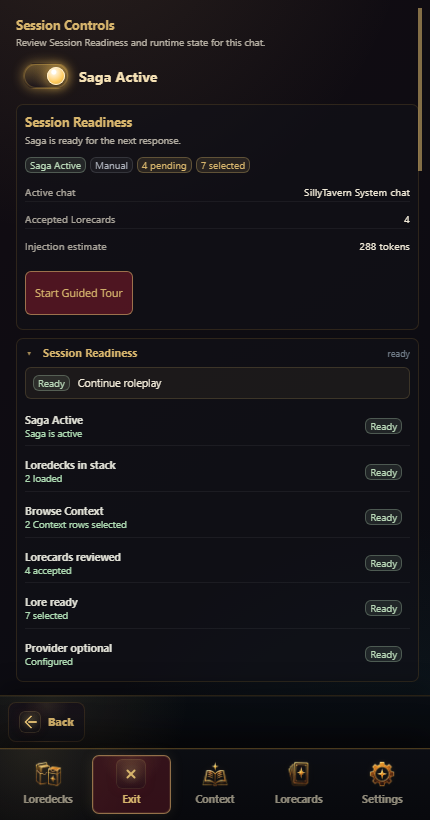

Tap the Session summary to open **Session Details** when you need the guided checklist, walkthrough notes, toggles, and metrics. Basic keeps the route compact so the first-run loop stays visible without exposing advanced diagnostics.

  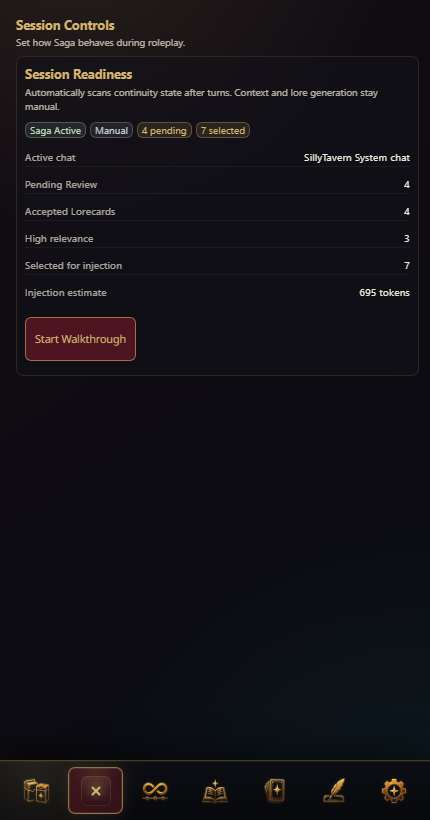

Advanced Session adds runtime metrics, Automation Mode state, Advanced Walkthrough routing, and Story Maker access while keeping the bottom navigation fixed.

  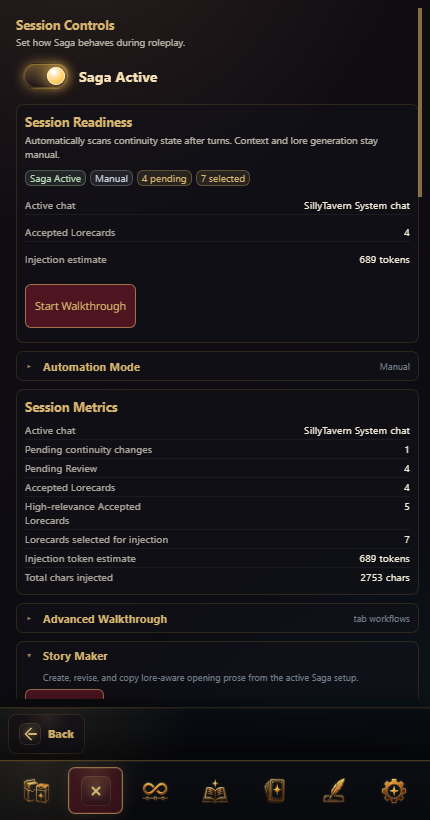

Use Advanced Session Details when you need deeper runtime status without switching to the desktop layout.

## Story Maker

  

**Story Maker** lives in the mobile **Session** route. Use it after Loredecks, Context, and useful Lorecards are ready, when you want Saga to create a lore-aware opening post for the current scene.

The mobile Story Maker workflow is:

1. Tap **Session**.
2. Open **Story Maker**.
3. Create or select a saved opener.
4. Fill **Inputs**.
5. Build the Context Packet and Opener Brief.
6. Draft variants.
7. Revise or copy the selected opener.

For every mobile field, stage, source action, variant action, revision path, and failure state, use [Story Maker Guide for Mobile](STORY_MAKER_MOBILE_GUIDE.md).

## Basic Mobile Loop

Use Basic mobile as a five-step loop:

1. Open **Loredecks** and confirm at least one deck is active.
2. Open **Context** and set or review the current story position.
3. Open **Lorecards** and review generated or suggested cards.
4. Return to the chat and continue roleplay.
5. Use **Settings** only when providers, experience mode, theme, or storage safety need attention.

The mobile shell is optimized for checking readiness and moving quickly between these surfaces. It intentionally avoids the dense desktop control room unless you switch to Advanced.

## Loredecks

  

The **Loredecks** route shows the active stack summary and the main Library action. Open the **Loredeck Library** to browse decks, add or remove active decks, reorder the stack, inspect details, import packages, or run Pack Health checks.

  

The mobile Library browse surface is card-first. Tap a deck card to add or remove it from the active order, use search and filters to narrow the list, and use the selected strip when you need to reorder active decks.

  

Long-press a deck card to open its detail sheet. The detail sheet is where you inspect metadata, source type, health state, and deck actions before trusting a deck in a long-running story.

  

Advanced mobile adds **Create Deck** alongside Library and import actions. Use Deck Maker only when you are ready for staged Loredeck authoring and review.

  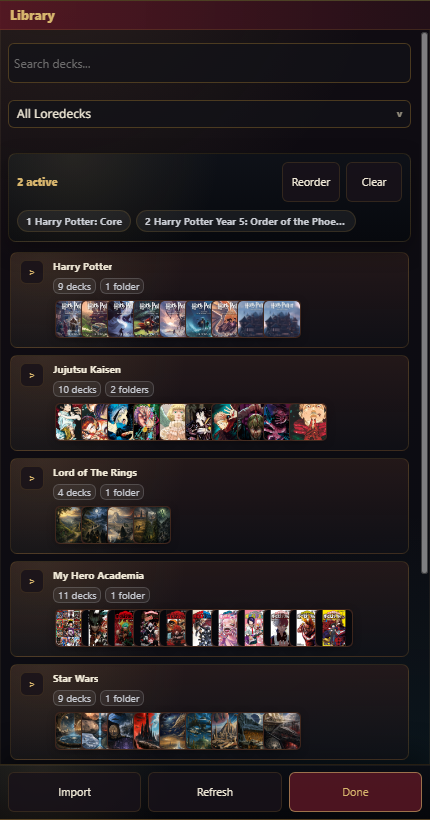

Advanced Library browse keeps the same touch model but exposes the fuller operator surface for generated packs, package work, and deeper inspection.

  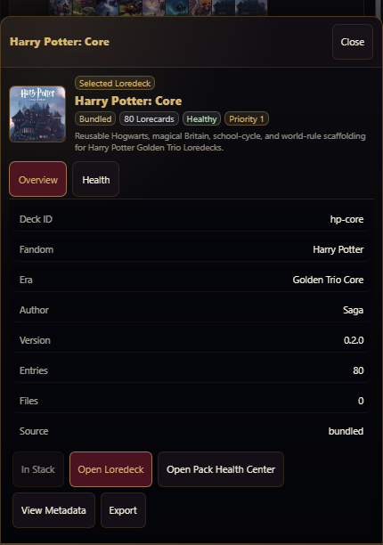

Advanced detail sheets add tabs and object actions for package diagnostics, export, health inspection, and other deck management work.

In the mobile Library:

- Tap a deck card to add or remove it from the active order.
- Long-press a deck card to open its detail sheet.
- Use **Reorder** in the selected strip to adjust active deck order.
- Use **Clear** only when you want to remove the selected active deck set.
- Open a detail sheet before trusting a deck in a long-running story.

## Pack Health

  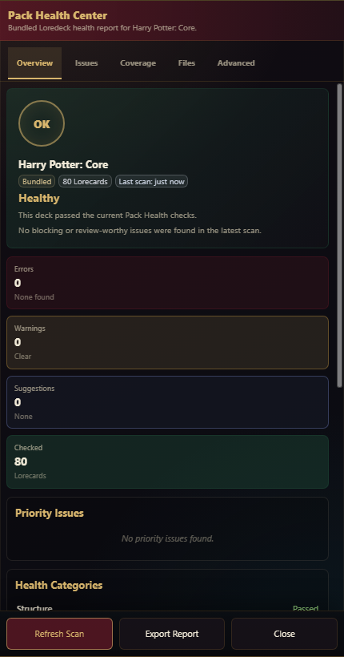

Basic mobile exposes Pack Health from the Loredeck detail sheet's **Health** tab. Use **Run Pack Health** after importing, generating, duplicating, or heavily editing a deck. Basic shows the health summary and scan action without opening the full repair center.

  

Advanced opens the **Pack Health Center** for grouped issues, repair sessions, package diagnostics, and exportable reports. A clean health report means the deck is structurally usable; it does not prove every lore claim is canon-perfect.

On mobile Advanced, Pack Health Center keeps primary actions at the bottom. Use **Refresh Scan** after changes, **Export Report** when collecting evidence, and **Close** to return to the Library.

## Context

  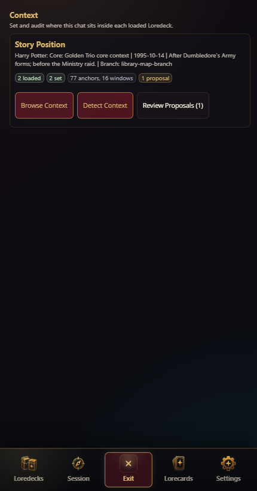

**Context** tells Saga where the chat is inside each loaded Loredeck. The mobile root route summarizes loaded decks, selected story positions, and pending proposals. Tap the Story Position summary to open Context Details.

  

Use Context Details to check the active Context source, selected story position, and lock state before you trust canon suggestions or injection.

  

Use **Browse Context** when you need to choose exact anchors, windows, dates, arcs, or phases. Basic keeps this manual path available because correct Context is the main guard against premature or stale lore.

  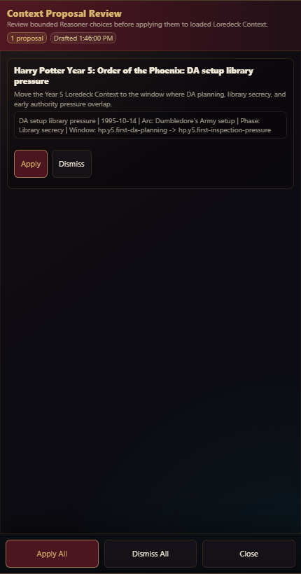

Use **Review Proposals** when Saga has Reasoner-backed Context changes waiting for review. Apply only proposals that match the current story branch.

  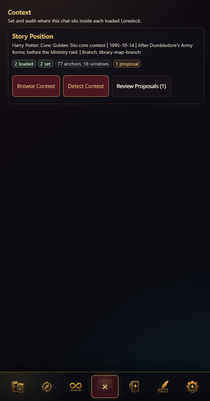

Advanced Context keeps the same mobile route shape while exposing deeper diagnostics and more context-management routes.

  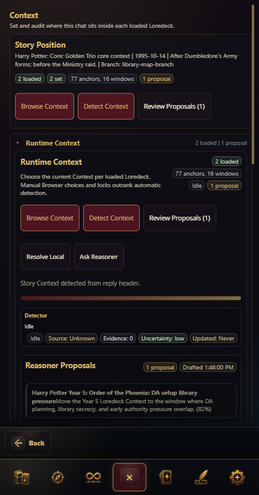

Advanced Context Details are for checking why a position is selected, whether a lock applies, and what Saga will use when resolving retrieval and injection.

  

Advanced Context Workbench gives the full manual picker and timeline browser on phone width.

  

Advanced proposal review is still review-first: Reasoner output should guide the operator, not silently change the story's active position.

## Lorecards

  

Mobile Lorecards use sub-tabs above the bottom bar:

- **Lore**: one object list for Pending Review, Accepted, High relevance, Elevated, and Muted Lorecards.
- **Generate**: canon preview, story scan, and Manual Lore Note drafting.
- **Automate**: Advanced-only Lore Automation status and controls.

In **Lore**, Pending Review and Accepted cards are object rows. Review Pending entries before they become durable lore. Accepted entries can be High relevance, Muted, Elevated, or protected by Lore Automation state. Tap the relevance dots to cycle tier, use the mic control to Mute, double-tap an Accepted card to toggle Elevation, and long-press to edit.

  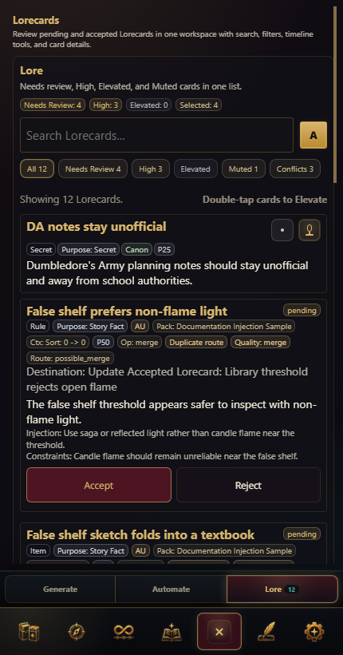

Advanced Lore keeps the same object-list model but exposes more filtering, review, and automation-aware state.

  

Use **Generate** for **Preview Canon Packs**, **Quick Add Top Matches**, **Scan Story Lore**, and **Draft Manual Note**. Generated or manually drafted lore still goes through Pending Review.

  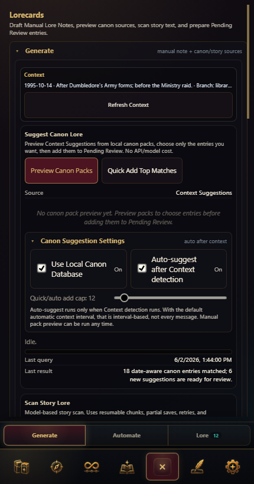

Advanced Generate adds the fuller generation and scan control surface while preserving the same review-first rule.

  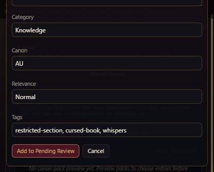

The Manual Lore Note form is for facts you already know Saga should remember. Keep notes narrow, choose tags deliberately, and send them to Pending Review before acceptance.

  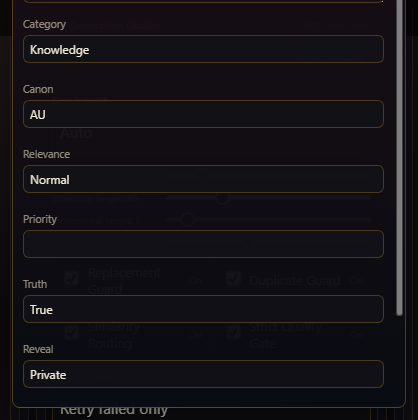

Advanced Manual Lore Note drafting exposes more metadata while keeping fields full-width and touch-friendly.

  

Long-press an Accepted Lorecard to edit it. The mobile editor keeps fields full-width and uses chip-style tag editing instead of dense desktop row controls.

### Automate

  

In Advanced, use **Automate** to inspect Lore Automation mode, cadence, recent activity, and per-card management. Automatic changes should remain inspectable and reviewable.

#### Mode

**Mode** controls how much authority Lore Automation has on mobile.

- **Off** means no mode button is selected. Background automation is disabled, and Saga will not change Accepted Lorecards unless you pick a mode or run a manual pass.
- **AR** is Auto-Relevance. Saga scores Accepted Lorecards against Context, scene state, and recent chat, then applies high-confidence Low, Normal, or High relevance changes.
- **ARMP** adds Muting and Prominence. Saga can add or remove automation-owned prompt Prominence and can Mute or unmute cards when the evidence is strong enough. ARMP does not Elevate cards; **Elevate** remains a user-controlled protection state.
- **ARMPC** adds Curating. Saga can accept useful active-deck Lorecards into Accepted Lorecards and retire stale automation-owned cards. ARMPC needs usable Context before it curates because it is choosing lore for the current story position.

Under the hood, Saga scores locally first, validates every operation before applying it, records changed runs in Recent Activity, and writes reversible changes to the Lore Timeline when possible.

#### Style

**Style** changes how cautious the selected Mode is.

- **Careful** has the strictest confidence bar. It makes fewer changes, curates very lightly, and requires repeated stale evidence before retiring automation-owned lore.
- **Balanced** is the default. It keeps the accepted stack moving with moderate relevance changes, limited Prominence/Mute cleanup, and small curation passes.
- **Aggressive** acts sooner and in larger batches. It is useful when the story has moved far from older accepted lore or when the accepted stack has become noisy.

Style does not unlock new powers. It only adjusts thresholds, caps, stale-card tolerance, and provider instructions inside the active Mode.

#### Pacing

**Pacing** controls how soon Auto cadence decides a background run is due.

- **Responsive** checks sooner by shrinking the effective word budgets.
- **Normal** uses the configured word budgets.
- **Relaxed** checks less often by expanding the effective word budgets.

The budgets are story-word budgets, not simple turn counters. **Remap word budget** controls relevance, Prominence, and Mute checks. **Curate word budget** controls ARMPC curation and retirement checks. The **Recent messages** field is different: it controls how much recent chat Saga reads as evidence during scoring.

#### Cadence

**Cadence** decides whether Saga can run in the background.

- **Manual** blocks background runs after model generations. Use **Run Now** when you want one deliberate pass.
- **Auto** lets Saga schedule a run when Context, the Active Stack, Accepted Lorecards, recent narrative, story-word budget, or ARMPC stack pressure says the lore state may need attention.

Auto cadence is still inspectable. Use **Status** for the latest summary, **Current tiers** for relevance counts, **Card control** for managed/protected card counts, **Recent Activity** for run history, and **Undo Last Run** when the latest reversible run should be rolled back.

## Continuity

  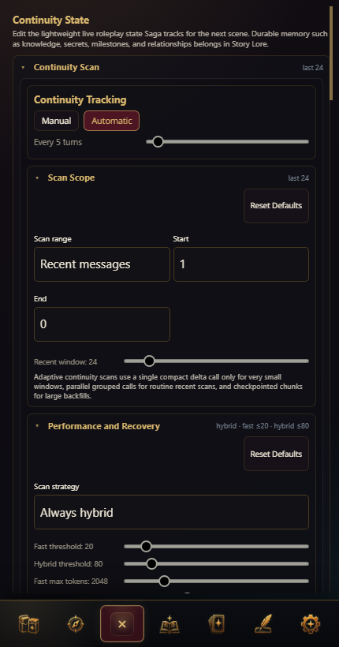

Continuity is Advanced-only on mobile. Use it for live state: scene, active characters, carried items, goals, and open threads. Continuity should not become a second static lore database.

  

Continuity Scan helps update current state from recent chat. Run it when the current scene changes enough that posture, location, possessions, goals, or active threads may need refreshing.

  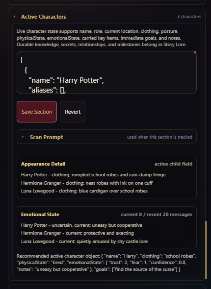

Character state is for what is currently true in the chat: location, posture, clothing, physical state, emotional state, carried items, goals, and immediate notes.

## Injection

  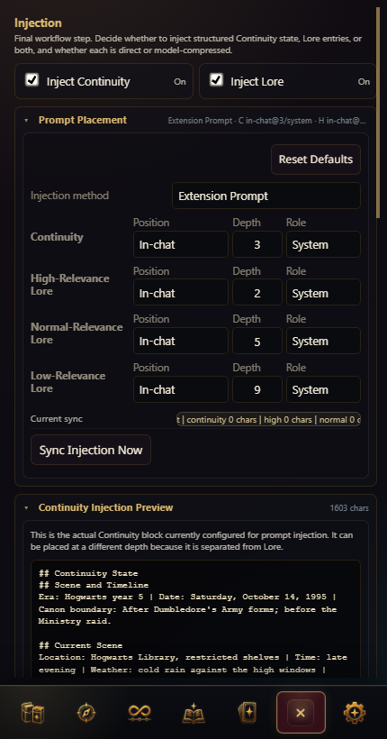

Injection is Advanced-only on mobile. Use it when debugging what Saga will send to the model. A Lorecard can exist and be accepted without injecting if it is muted, out of Context, disabled, lower priority, or outside the configured prompt budget.

  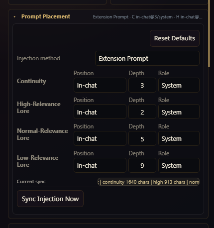

Prompt Placement controls decide where Continuity and each Lorecard relevance tier are inserted into the model context.

  

The preview is the operator truth source for "why did the model know this?" and "why did the model forget this?"

## Deck Maker

  

The mobile Deck Maker keeps the current task and review queue near the top. Use it for staged Loredeck authoring, not one-shot generation. Generated material remains draft material until reviewed, moved to Pending Review, accepted, and checked in Pack Health.

For every mobile stage, current-task action, project input, draft-review path, Pack Health action, and finalization gate, use [Deck Maker Guide for Mobile](DECK_MAKER_MOBILE_GUIDE.md).

## Settings

  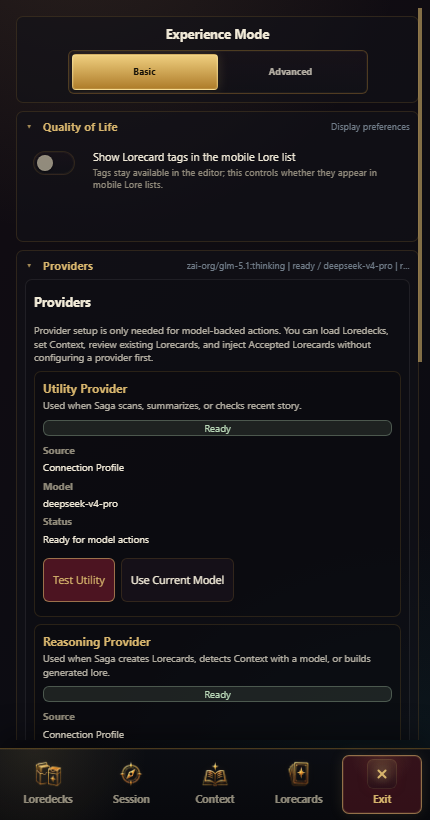

Use Basic Settings for experience mode, provider readiness, theme selection, and routine setup. Basic hides advanced endpoint internals and storage maintenance until you switch to Advanced.

  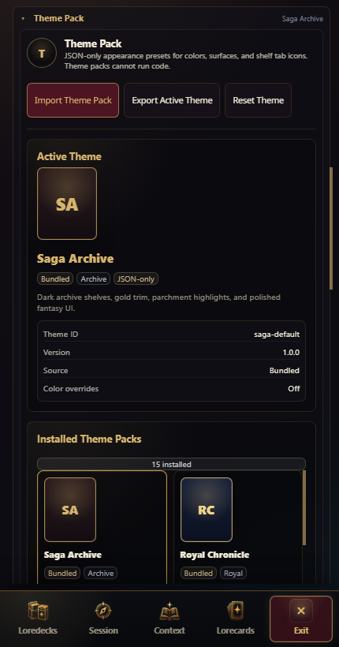

Theme Packs and Icon Sets are passive appearance data. They can change the mobile shelf's color, surfaces, and icons without running code.

  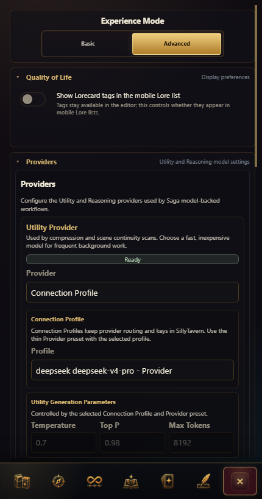

Advanced Settings expose provider routing, State Safety, cleanup, and deeper runtime configuration.

  

Prefer SillyTavern Connection Profiles for provider isolation when available. Use direct OpenAI-compatible endpoints mainly for alpha testing or local endpoints you trust.

  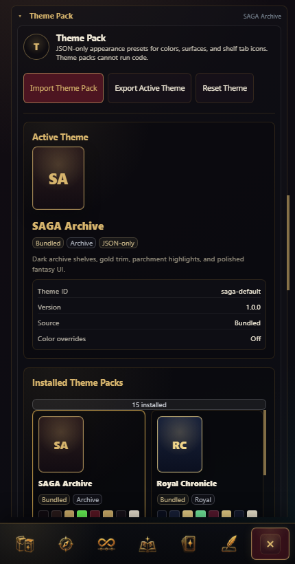

Advanced Theme Pack controls show the active pack, installed packs, import/export actions, and the current visual palette used by the mobile shell.

## Mobile Troubleshooting

| Problem | First check |
| --- | --- |
| Bottom bar is missing | Confirm the viewport is phone-width and Saga is open. Wider tablet/desktop viewports use the desktop shell. |
| Active tab says Exit | That is expected. Tap **Exit** to close Saga or another route to switch surfaces. |
| A Loredeck detail sheet will not open | Long-press the deck card instead of tapping it. Tapping toggles active order. |
| Lorecard edit controls are not visible | Long-press an Accepted Lorecard row. Mobile hides permanent row-action button stacks. |
| Injection or Continuity is missing | Switch to Advanced. Basic mobile keeps those routes hidden. |
| Context feels wrong | Open Context, review the Story Position summary, then use Browse Context or Review Proposals. |
| A generated deck behaves strangely | Open its detail sheet, then run Pack Health. |
