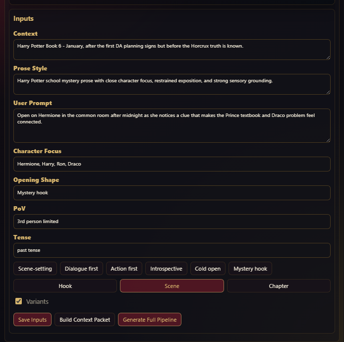
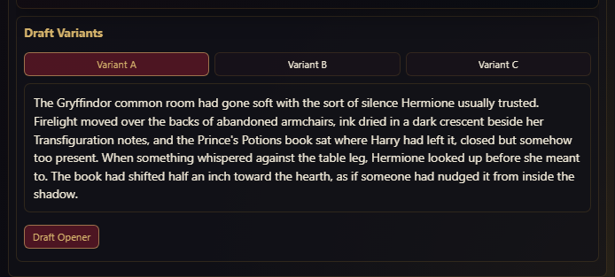
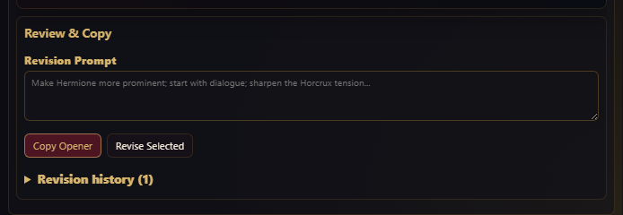

# Story Maker Guide for Desktop

This guide covers the desktop and tablet-width **Story Maker** UI. It assumes you are using the desktop rail and drawer, not the phone-width mobile shell.

Story Maker lives on the **Session** tab. It creates, revises, and copies an opening message for a roleplay scene by using the active Saga setup: loaded Loredecks, current Context, accepted Lorecards, and the Reasoning Provider.

Use Story Maker when you want Saga to help write the first post for a new chat, restart a scene cleanly, or produce a lore-aware opener without hand-copying facts from Loredecks and Lorecards.

## Requirements

Story Maker works best when:

- **Saga Active** is on.
- At least one Loredeck is loaded in the active stack.
- Context is selected for the loaded Loredecks.
- Useful Lorecards have been accepted or the active Loredecks contain enough eligible facts.
- A **Reasoning Provider** is configured for model-backed drafting.

Story Maker can still save inputs without a provider. Provider-backed actions such as packet building, brief generation, opener drafting, and revision require a working Reasoning Provider.

## Where It Lives

Open Saga, choose **Session**, and scroll to **Story Maker**. The desktop section appears after Session metrics and the walkthrough card in the current Session tab layout.

The section header shows the feature name and purpose. Open the section to see:

- **New Opener**
- **Saved openers**
- the active opener title
- status chips
- the stage bar
- the current stage card

## Saved Openers

Story Maker stores opener sessions in external Saga storage. The shelf shows **Saved openers (N)** with one row per saved opener.

Each opener row shows:

- opener title
- current stage
- source summary
- a **Delete** action

Use **New Opener** to create a fresh Story Maker session. Deleting an opener removes that saved Story Maker session and its payload file. It does not delete Loredecks, Lorecards, Context, or chat messages.

## Stage Bar

Story Maker uses a compact Deck Maker-style stage bar:

1. **Inputs**
2. **Context Packet**
3. **Opener Brief**
4. **Draft Variants**
5. **Review & Copy**

Click an unlocked stage to inspect it. Locked stages show the dependency that must be completed first. Completed stages can show a reset control. Resetting to a stage clears later generated work for that opener, so use it when the source setup or direction changed enough that downstream text should be rebuilt.

When a provider-backed Story Maker action is running, Story Maker shows a compact live generation status row under the stage bar. It names the current stage, shows the current generation message, and updates elapsed time while the run is queued, running, retrying, drafting, or revising. Keep the section open if you want to watch long runs progress; the generated stage card updates when the run finishes.

## Inputs

  

The **Inputs** stage is where you define what the opener should do.

Fields:

- **Context**: the story position and situation the opener should start from.
- **Prose Style**: tone, voice, pacing, and style guidance.
- **User Prompt**: the concrete opening instruction.
- **Character Focus**: characters or factions to emphasize.
- **Opening Shape**: the structural kind of opener.
- **PoV**: point of view guidance.
- **Tense**: tense guidance.

Opening-shape quick buttons help fill **Opening Shape**:

- **Scene-setting**
- **Dialogue first**
- **Action first**
- **Introspective**
- **Cold open**
- **Mystery hook**

Length controls:

- **Hook**: shortest opener.
- **Scene**: normal roleplay opener.
- **Chapter**: longer setup.

The **Variants** toggle controls whether Story Maker drafts one opener or multiple alternatives. When enabled, Story Maker asks for three opener variants after the brief.

Actions:

- **Save Inputs**: saves the current fields without generating.
- **Build Context Packet**: resolves current sources and builds the lore packet.
- **Generate Full Pipeline**: builds packet, builds brief, and drafts opener variants in sequence.

Use **Save Inputs** before leaving the section if you have not generated yet.

## Source Actions

Above the input fields, Story Maker exposes source-management actions once an opener exists:

- **Refresh From Saved Sources**: keeps the saved source intent but resolves it against the latest Loredecks and Context.
- **Use Current Active Stack**: replaces the opener's saved source intent with the current active Loredeck stack and current Context.

Use **Refresh From Saved Sources** when the opener should keep its original plan but the underlying source data may have changed. Use **Use Current Active Stack** when you deliberately changed which Loredecks or Context should drive this opener.

## Context Packet

The **Context Packet** stage resolves the raw source setup into writing-safe lore constraints.

It shows:

- source resolution status
- detected fandoms
- eligible facts
- blocked facts
- opener Context
- must-use facts
- fresh/current-window facts
- must-avoid constraints

The must-avoid list is important. It is where Story Maker keeps future-only facts, hidden reveals, expired details, or Context-blocked material out of the opener.

Run **Build Context Packet** when:

- Context changed.
- the active stack changed.
- you accepted new Lorecards that should influence the opener.
- the previous opener draft seems to include stale or premature lore.

## Opener Brief

The **Opener Brief** stage turns the Context Packet and input direction into a writing plan.

It can include:

- premise
- style guidance
- opening shape
- target length
- character focus
- PoV and tense
- scene plan beats

Use **Build Opener Brief** when the packet is current but the writing plan has not been generated or needs to be rebuilt after input changes.

## Draft Variants

  

The **Draft Variants** stage holds generated opener text.

When variants are enabled, the stage shows **Variant A**, **Variant B**, and **Variant C** tabs. Click a variant to make it the selected opener. The selected variant is the one used by **Review & Copy** and the copy buttons.

Use **Draft Opener** to generate opener text from the brief. If the draft is not close enough, update the input fields or revise the selected variant instead of accepting a weak opening.

## Review & Copy

  

The **Review & Copy** stage is the final operator checkpoint.

Controls:

- **Revision Prompt**: instruction for changing the selected opener.
- **Copy Markdown to Clipboard**: copies the selected opener as raw Markdown.
- **Copy Rich-Text to Clipboard**: copies the selected opener with rendered Markdown and dialogue quote color.
- **Revise Selected**: asks the Reasoning Provider to revise only the selected opener.
- **Revision history**: shows prior revision instructions and snippets.

Use revision prompts for concrete changes such as:

- "Make Hermione more central."
- "Reduce exposition."
- "Start with dialogue."
- "Make the threat quieter and less obvious."
- "Remove future canon knowledge."

After copying, paste the opener into the SillyTavern chat or your preferred writing surface.

## Failure States

Story Maker shows failure cards when provider or validation work fails. Read the failure message and recovery hint before retrying.

Common fixes:

- If source resolution fails, check active Loredecks and Context.
- If the provider fails, test the Reasoning Provider in Settings.
- If output includes premature facts, rebuild the Context Packet and check must-avoid constraints.
- If the opener is stylistically wrong, revise the selected variant or update **Prose Style** and rebuild.

## Desktop Workflow

1. Load Loredecks in **Loredecks**.
2. Set Context in **Context**.
3. Accept any useful Lorecards in **Lorecards**.
4. Open **Session > Story Maker**.
5. Click **New Opener**.
6. Fill **Context**, **Prose Style**, **User Prompt**, **Character Focus**, **Opening Shape**, **PoV**, **Tense**, and target length.
7. Enable **Variants** if you want multiple options.
8. Click **Generate Full Pipeline**.
9. Review the Context Packet and Opener Brief if the output feels off.
10. Choose the best variant.
11. Use **Review & Copy** to revise or copy the opener.
